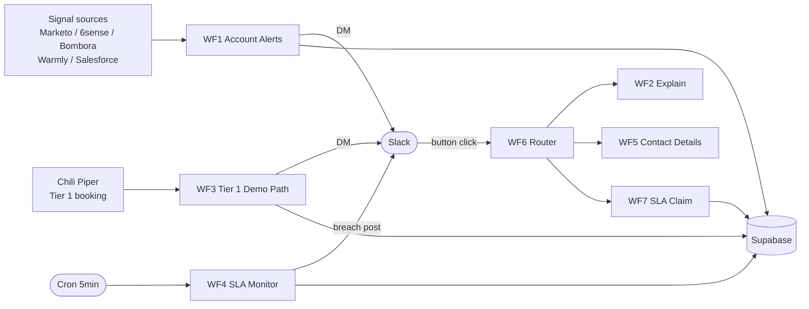

# Inbound Synthesis Engine

GTM teams already pay for the signals. Inbound Synthesis Engine fuses them into one alert reps will actually act on.

## What this is

Account-level signals — Marketo form fills, 6sense intent surge, Bombora topic spikes, Warmly visitor identification, Salesforce context — sit in five separate panes of glass. This service reads them all, scores the account, picks the best contact, and posts a single Slack alert with the buying-stage narrative and the next action attached. Reps reply from Slack; SLAs auto-escalate; Tier 1 demo bookings page the rep within seconds of the form fill.

Portfolio GTM Engineering build. All data is synthetic. Demoable end-to-end.

## Architecture

See [docs/architecture.md](docs/architecture.md) for the full Mermaid diagram and per-workflow node chains.



## Tech stack

| Layer | Choice |
|---|---|
| Workflows | n8n (self-hosted at `n8n.mindofhenry.xyz`) |
| Database | Supabase Postgres (shared Beacon project) |
| Alerts | Slack Block Kit + incoming webhooks + interactivity |
| LLM | Claude Haiku (alert blurbs, buying-stage explain) |
| CRM mock | Salesforce sandbox (synthetic accounts + opps) |
| Data gen / loaders | Python |
| Scripts | PowerShell (Windows host) |
| System of record | Linear project `inbound-synthesis-engine-66dbe690d9d7` |

## Workflow inventory

| WF | Name | Status | Trigger |
|---|---|---|---|
| WF1 | Account Alerts | active | webhook (signal in) |
| WF2 | Explain Callback | active | webhook `internal/explain-score` (via WF6) |
| WF3 | Tier 1 Demo Path | inactive (demo-fired) | webhook `tier1-demo` (Chili Piper) |
| WF4 | SLA Monitor | active | cron, every 5 min |
| WF5 | Contact Details Callback | active | webhook `internal/contact-details` (via WF6) |
| WF6 | Slack Interactivity Router | active | webhook `slack-interactivity` (Slack) |
| WF7 | SLA Claim Handler | active | webhook `internal/sla-claim` (via WF6) |

WF6 owns the single Slack interactivity URL. New callbacks plug in as a Switch case, not a new Slack app config.

## Quickstart

```powershell
# 1. Clone
git clone https://github.com/mindofhenry/inbound-synthesis-engine
Set-Location inbound-synthesis-engine

# 2. Env vars (Beacon Supabase + Slack + Anthropic + n8n host)
Copy-Item .env.example .env
# fill in: SUPABASE_URL, SUPABASE_SERVICE_ROLE_KEY, SLACK_BOT_TOKEN,
#         ANTHROPIC_API_KEY, N8N_HOST

# 3. Apply migrations (in order)
# Supabase SQL editor — run db/migrations/001 .. 004 in numeric order

# 4. Seed signal_events (Orion Analytics — the canonical demo account)
# See docs/smoke-test.md for the seed SQL

# 5. Fire a Tier 1 booking → Slack DM
.\scripts\fire-tier1-demo.ps1 `
  -AccountName "Orion Analytics" `
  -ContactEmail "rachel.kim@orionanalytics.io" `
  -ContactName "Rachel Kim" `
  -ContactTitle "VP Engineering"
```

Full smoke-test runbook: [docs/smoke-test.md](docs/smoke-test.md). End-to-end demo runbook (Tier 1 + SLA breach + Claim): [docs/demo-runbook.md](docs/demo-runbook.md).

## Links

- **Loom walkthrough:** _coming soon_
- **Notion proposal:** https://www.notion.so/3450592291a88128a6b7c12ef2325338
- **Linear project:** https://linear.app/mindofhenry/project/inbound-synthesis-engine-66dbe690d9d7
- **GitHub:** https://github.com/mindofhenry/inbound-synthesis-engine

---

Built by Henry Marble. All data is synthetic — generated for portfolio demo, not from any production system.
