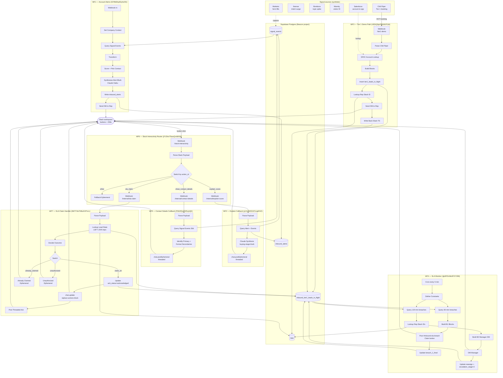

# Architecture

End-to-end map of the Inbound Synthesis Engine. Seven n8n workflows fan out
from a single Slack interactivity URL and a small set of Postgres tables in
the shared Beacon Supabase project.

## System diagram

## Conventions

- **One Slack interactivity URL.** All buttons post to `/webhook/slack-interactivity` (WF6). The router dispatches to the correct internal handler by `action_id`. Adding a fourth callback is a new Switch case, not a new Slack app config.
- **Internal webhooks are unauthenticated by design** — only the router calls them, and they live behind the same hostname.
- **All DB writes go through the service-role key.** No per-user RLS; this is a single-tenant demo.
- **Block Kit `blocksUi` must be `JSON.stringify({ blocks: [...] })`**, not a bare stringified array. Slack node v2.4 silently drops the field otherwise.

## Workflow IDs at a glance

| WF | Name | ID |
|---|---|---|
| WF1 | Account Alerts | `3378kEby9ZyhzIOk` |
| WF2 | Explain Callback | `yU1s6WS1N7vvgEGO` |
| WF3 | Tier 1 Demo Path | `UElhQ0juFRKMVP1W` |
| WF4 | SLA Monitor | `JjpSFDnMo3FXYX96` |
| WF5 | Contact Details Callback | `P0bOfQyk525cjnQK` |
| WF6 | Slack Interactivity Router | `jYU3no70wwQrnMXW` |
| WF7 | SLA Claim Handler | `0M7Y3m7hBuGVPvLL` |
